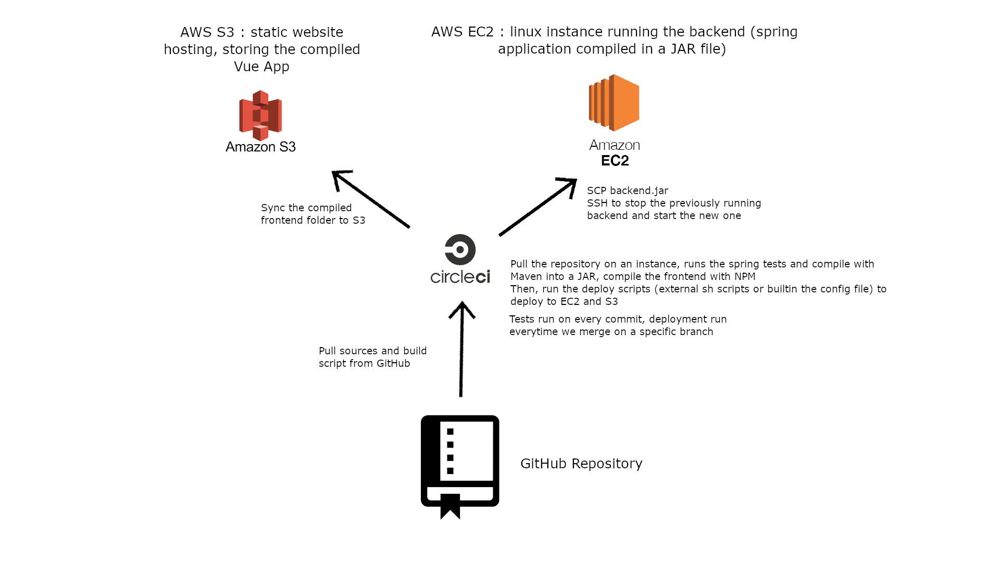

# Portfolio B

## Development Testing

For development testing, we've setup a Continuous Integration pipeline with CircleCI.
For each commit, CircleCI pulls the repository and runs our test suite for Spring using Maven, the feedback is automatically displayed on GitHub. This enables us to ensure the correctness of our code at any moment during the development.

Due to lack of time, we couldn't write as many unit test classes as we would have needed. Ideally we would have written a test for each method, writing the tests before the implementation to ensure the robustness to limit cases and exceptional events. The person who writes the tests shouldn't be the same who writes the implementation.

This avoid writing tests only for part of codes easy to test (depending on the implementation).
It also enables to identify quickly when a modification introduces a bug.
Writing tests before coding guides the developper at each step of the implementation and makes him focus on solving one problem at a time. The code tends to be less complex.

For the front end, we didn't use any unit tests. We prefered to verify that the application was working correctly manually. Firstly because it is complicated to write tests for something visual, and secondly because it doesn't contain "crucial" code. It was more convenient this way. However CircleCI tests that the code compiles correctly.

To write our test, we used Spring Boot builtin tools such as DataJpaTest for the persistence layer, Junit for general Unit testing, WebMvcTest for testing the http controllers...

## Test Example

Example of test case : SessionController component (integration test running with the full context loaded) which offers the REST api relating to teaching sessions.

This test suite enables to ensure that api calls are always secured (require authentication) and have the expected effect on the database.

First test : querying /api/allsessions without providing a mock user (equivalent to not being authenticated). Expected behaviour : returning a 401 unauthotorized status.

Second test : adding a session with title "testTitle", querying all the sessions. Expected behavior : status ok and responseJSON[0].title == "testTitle"

Third test : nextSessions and completedSessions correctly returns, respectively, not completed and completed sessions. This test creates a new session (by default not completed), then query nextSessions. It ensures the created session is present in the response. Then it marks it as complete, saves it, and query nextSessions and completedSessions. The first one should be empty and the second one should contains the session.