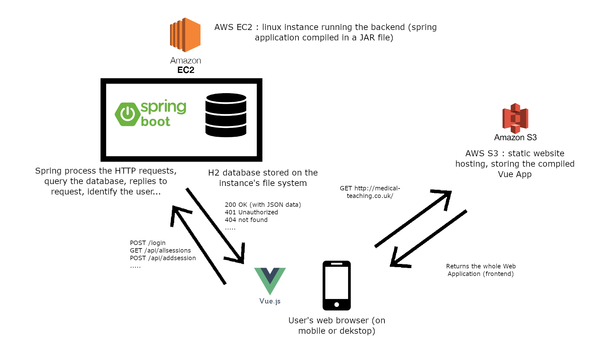

# Portfolio B

## Architecture choices

The basic idea of the project is to enable doctors to inform students of available bedside teaching sessions during their work and be able to quickly inform them of any changes.

From this observation, the main attribute of our project is that it needs to be available mainly on mobile, because every doctor and student have a smartphone and can easily access it during their work (it would also be practical for them to be able to access the app via the hospital computers, but not necessarily).

We then had two choices: either build a native application, or create a “Web-app” : a website adapted for mobile users imitating a mobile app.

We chose to create a Web Applicationn. First, because it is easier to maintain on different platform. Although it is possible to use React Native to develop for android and iOs at the same time, it sometimes requires specific pieces of code for each OS. Moreover, it is convenient for the users to be able to access the app from their computer (and without installing anything). 
We chose to use the framework Vue.js. After some research, it seemed to be easier to begin with than React.js or Angular.js, and more leightweight. Also we appreciated its syntax : close to classic web programming (with a part for html or "template", a part for css or "style", and a part for javascript).
It was not really a crucial choice and the application would have been roughly the same if we used another framework (for what we needed, they provide the same features).

Because the project aims to enable doctors to publish teaching sessions that are communicated to every student, we need to have a central place to keep the data and it them available all the time. This implies we must run a classic database on a server, where all the data is managed.

As we are advised to do for this unit, our back-end framework is Spring, that connects to a database.
We use a h2 database, which is contained into a single file on the server. This is sufficient for the use-case of our project (a relatively small number of users, which won't radically evolve over time) and requires almost no configuration.
The Spring Boot application communicates with the user’s devices via HTTP, exposing an API to the front-end which requests the needed data (user accounts, teaching sessions, feedbacks...) stored in the database.

After discussing with our client, it was decided that the application will be hosted on a cloud provider such as AWS, rather than a private server on the hospital for example.

For this application, using advanced architecture design such as load-balancing and auto scalability isn't relevant, because the number of users is known and won't evolve rapidly over time. We can rely on a single EC2 instance (for the moment the small free tier instance is enough) containing both the application and the app, and a content delivery network (such as AWS CloudFront) isn't necessary for the front end.

### High-level architecture diagram

The Spring Boot backend application is packaged into a JAR file (executable with a Java Runtime Environment) and runs on an AWS EC2 instance. The EC2 instance is a Linux machine which runs in the Cloud, listening on http port.
The Vue frontend application is packaged into html, css and javascript files. It is stored on an AWS S3 bucket configured to serve a static website.
When the user tries to access to the WebApp with its web browser, the S3 bucket returns the frontend's files to execute the application.
The Spring Boot application offers an API to interact with HTTP requests (to GET or POST data for example).

The frontend app knows the IP address of the backend server, and enables the user to navigate through the interface and automatically triggers requests to access remote data. For example, when the user access the page displaying upcoming teaching sessions, the Vue App sends a request to the backend which returns the list of sessions (if the user is authenticated), then, the Vue app interprets and displays the JSON data received. 

This diagram was made to gain a better understanding of how each (high level) component will interact with each others in the final version of our application. It helped us to make choices about hosting, deployment configuration...

## UML Diagram

**Object Classes:**

*User*: Represents a user on the application

*Session*: Represents a session that will occur

*Booking*: Represents the booking of a *Session*

*Feedback*: Represents feedback for a given *Session*.

