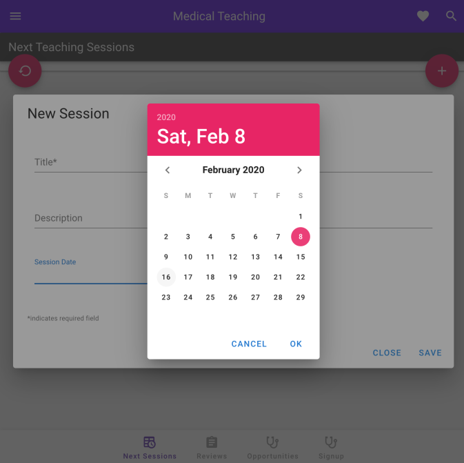
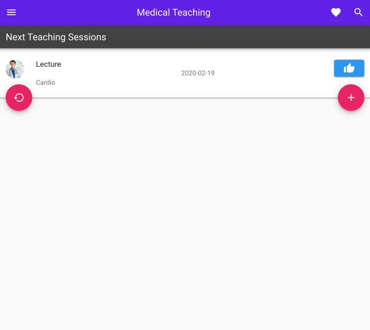
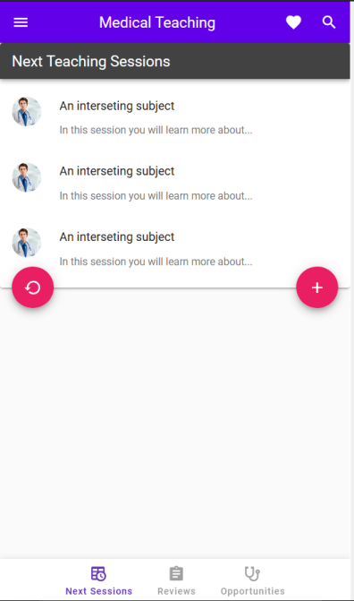
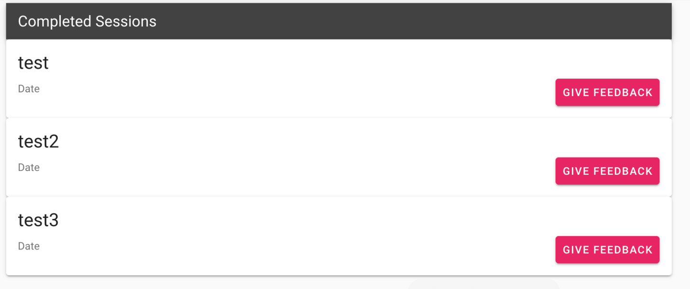
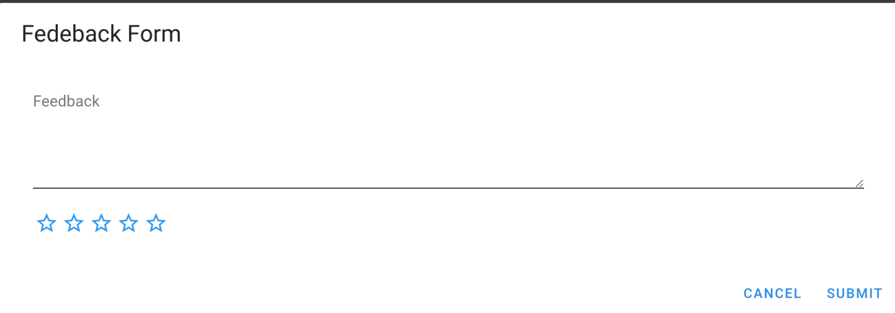

# NHS App
 An application required by the Bristol Royal Infirmiary to help doctors and students book teaching sessions in the hospital.
 
 Backend is created with SpringBoot using Java to handle security and web requests.
 The frontend was made using Vue.

-See the separate README files for the front end (folder "vue frontend") and the backend (folder "spring application") to run the project. -CircleCI configuration (CI/CD) is in ".circleci" folder

